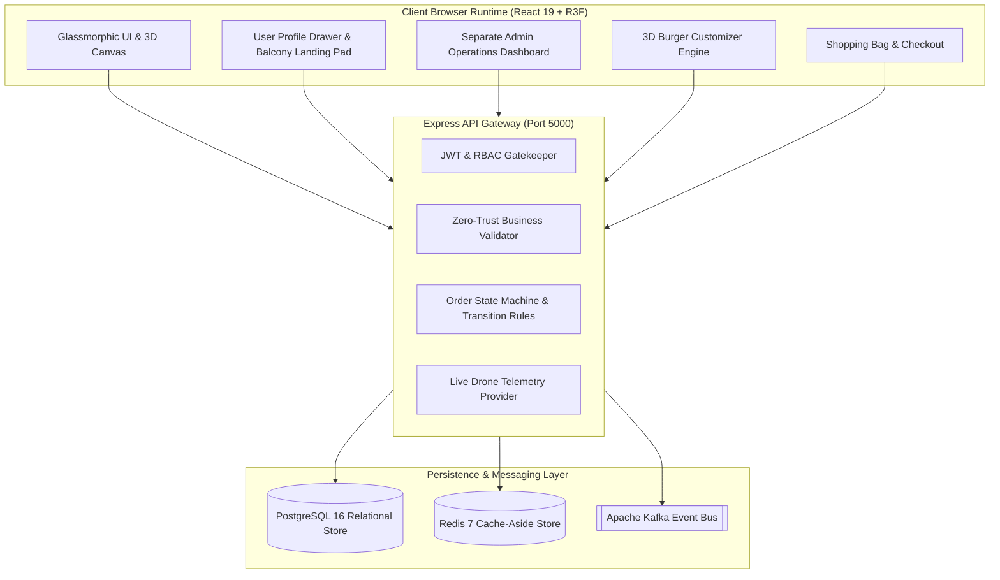
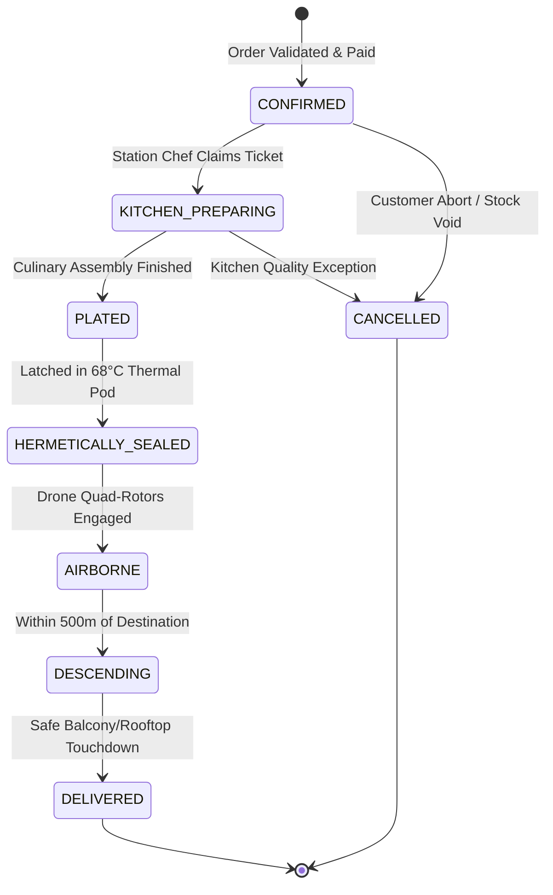
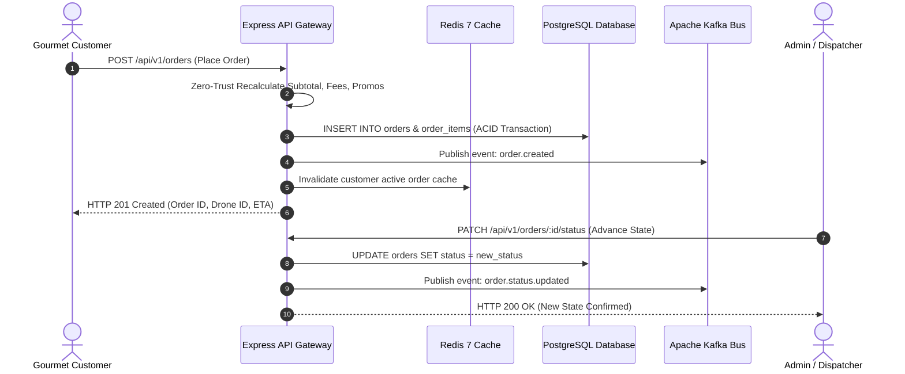

# Nayeem Spices // 3D Animated Food Delivery Platform

> **Artisanal Gastronomy infused with Chef Nayeem's Signature Spices & Autonomous Drone Delivery.**

A production-grade, interactive 3D web application built with **React 19**, **TypeScript**, **Three.js**, **React Three Fiber**, **Tailwind CSS v4**, and **Framer Motion**.

---

## ✨ Features

* 🍔 **Interactive 3D Food Models**:
  * Real-time 3D rendered **Wagyu Supreme Burger**, **Truffle Pizza**, **Kyoto Ramen**, and **Dragon Sushi**.
  * **Exploded View Mode**: Separate each culinary layer vertically in 3D space to inspect ingredients.
  * 360° mouse-responsive orbit tracking and rising aroma particles.
* 🛸 **3D Autonomous Drone Radar Simulation**:
  * Animated quad-rotor delivery drone with high-speed spinning propellers and an insulated thermal food pod latched underneath.
  * Infinite scrolling 3D city road grid with live flight altitude, speed, and real-time pod temperature sensor telemetry.
* 🛠️ **3D Burger Customizer Lab**:
  * Real-time patty thickness, artisan cheese melts, and gourmet extras with dynamic calorie and price updates.
* 🛍️ **Interactive Slide-Out Cart & Checkout**:
  * Item modifiers, delivery mode toggle (*Autonomous Drone Pod* vs. *Hyper Courier*), promo code validation (`NAYEEM` for $5 off), and order confirmation toast.
* 📍 **Modern Responsive UI**:
  * Glassmorphic navigation bar with custom **Taste** logo emblem.
  * Live search filtering, category tabs, and customer critic reviews.
* 👤 **User Profile Section (Side to the Bar)**:
  * Interactive user profile drawer showing delivery addresses, balcony drone landing pad settings, order history, loyalty points, and role simulation.
* 🛡️ **Separate Cybernetic Admin Dashboard**:
  * Dedicated administrative command console for live order pipeline state transitions, menu inventory toggles, and drone fleet radar telemetry.

---

## 🛠️ Technology Stack

* **Frontend**: [React 19](https://react.dev/), [TypeScript](https://www.typescriptlang.org/), [Vite 8](https://vite.dev/)
* **Backend**: [Node.js](https://nodejs.org/), [Express](https://expressjs.com/), [PostgreSQL](https://www.postgresql.org/), [Redis](https://redis.io/), [Apache Kafka](https://kafka.apache.org/)
* **Styling**: [Tailwind CSS v4](https://tailwindcss.com/)
* **3D Graphics**: [Three.js](https://threejs.org/), [@react-three/fiber](https://r3f.docs.pmnd.rs/), [@react-three/drei](https://github.com/pmndrs/drei)
* **Animation & Motion**: [Framer Motion](https://www.framer.com/motion/)
* **Icons**: [Lucide React](https://lucide.dev/)

---

## 🚀 Getting Started

### Prerequisites

* [Node.js](https://nodejs.org/) (v18 or higher recommended)
* npm (v9 or higher)
* [Docker Desktop](https://www.docker.com/products/docker-desktop/) *(Optional: for PostgreSQL, Redis & Kafka containers)*

### Installation

1. **Clone the repository**:
   ```bash
   git clone https://github.com/ksnayeem/Food-Delivery-3D-design-.git
   cd Food-Delivery-3D-design-
   ```

2. **Install frontend dependencies**:
   ```bash
   npm install
   ```

3. **Install backend dependencies**:
   ```bash
   cd backend
   npm install
   cd ..
   ```

4. **Start the local development servers**:
   * **Backend API Gateway** (Port `5000`):
     ```bash
     cd backend
     npm run dev
     ```
   * **Frontend Application** (Port `5173`):
     ```bash
     npm run dev
     ```
   Open [http://localhost:5173/Food-Delivery-3D-design-/](http://localhost:5173/Food-Delivery-3D-design-/) in your browser.

5. **Build for production**:
   ```bash
   npm run build
   ```

6. **Optional: Launch with Docker Compose (PostgreSQL + Redis + Kafka)**:
   ```bash
   docker-compose up -d
   ```

---

## 🧠 Theoretical Foundations & Engineering Architecture ("Theory Part")

Below is the theoretical and conceptual analysis of the algorithmic systems, physics simulations, domain state machines, and distributed architecture powering the Nayeem Spices platform.



---

### 1. Theory of 3D Procedural WebGL Rendering & Spatial Kinematics

The 3D presentation layer relies on **Three.js** orchestrated via **React Three Fiber (R3F)** to render interactive procedural culinary assets directly on the GPU without relying on heavy external asset files.

#### 1.1 Physically-Based Rendering (PBR) Materials
Every culinary element (artisan brioche bun, seared Wagyu patty, glazed pancetta, melting Gouda, fresh nori, and sushi salmon) implements PBR surface shaders adhering to the **Cook-Torrance Microfacet Reflectance Model**:

$$f_r(\mathbf{\omega}_i, \mathbf{\omega}_o) = k_d \frac{c}{\pi} + k_s \frac{D(\mathbf{h}) F(\mathbf{\omega}_o, \mathbf{h}) G(\mathbf{\omega}_i, \mathbf{\omega}_o)}{4 (\mathbf{n} \cdot \mathbf{\omega}_i)(\mathbf{n} \cdot \mathbf{\omega}_o)}$$

* **Diffuse Component ($k_d$)**: Lambertian reflectance with customized albedo tints representing gourmet sear crust and brioche crumb.
* **Microfacet Distribution ($D(\mathbf{h})$)**: GGX / Trowbridge-Reitz normal distribution modeling the rough matte surface of charred grill marks versus the specular sheen of warm truffle glaze.
* **Fresnel Term ($F$)**: Schlick's approximation representing grazing-angle light bounces on the curved surface of melting cheese.

#### 1.2 Mathematical Formulation of Layer Exploded View
The 3D food inspection studio provides an **Exploded View Mode** allowing users to inspect individual ingredients along their vertical axial coordinate. The spatial translation of each layer $i \in \{0, 1, \dots, N-1\}$ at time $t$ follows a linear parametric expansion damped by an ease-out spring function:

$$\vec{P}_{\text{exploded}}(i, t) = \vec{P}_0(i) + \left( (i - \bar{i}) \cdot \Delta h \cdot \sigma(t) \right) \hat{\mathbf{k}}$$

Where:
* $\vec{P}_0(i)$ is the resting assembly coordinate of layer $i$.
* $\bar{i} = \frac{N-1}{2}$ is the vertical geometric center of the dish.
* $\Delta h$ is the layer separation displacement constant ($\Delta h \approx 0.45\text{m}$).
* $\sigma(t) \in [0, 1]$ is the continuous normalized animation progression driven by Framer Motion / R3F render loop.

#### 1.3 Aroma Steam Dynamics via Numerical Integration
Aroma steam particles rising from freshly cooked dishes are governed by discrete numerical integration with buoyancy and Brownian noise:

$$\vec{v}_{t+\Delta t} = \vec{v}_t + \left( \vec{a}_{\text{buoyancy}} - \gamma \vec{v}_t + \vec{\xi}_{\text{thermal}} \right) \Delta t$$
$$\vec{x}_{t+\Delta t} = \vec{x}_t + \vec{v}_{t+\Delta t} \Delta t$$

When particles exceed their threshold altitude ($y > y_{\max}$), their alpha channel attenuates smoothly ($\alpha(y) = 1 - \frac{y}{y_{\max}}$) and their position is recycled to the hot food surface.

---

### 2. Theory of Autonomous Aerial Drone Aerodynamics & Thermal Thermodynamics

The delivery tracking system simulates an autonomous quad-rotor unmanned aerial vehicle (**UAV POD-DRONE-X9**) equipped with an insulated thermal food chamber.

```
       [Rotor 1] (CW)                  [Rotor 2] (CCW)
             \                                /
              \=== [Carbon Fiber Airframe] ===/
                             ||
              /=== [Flight Computer Core] ===\
             /                                \
       [Rotor 3] (CCW)                 [Rotor 4] (CW)
                             ||
            +----------------------------------+
            |  Hermetic Thermal Isolation Pod  |
            |   Target Temperature: 68.0°C     |
            |     PTC Active Heating Strip     |
            +----------------------------------+
```

#### 2.1 Thermal Pod Heat Loss & Newton's Law of Cooling
Gourmet dishes must arrive at tasting temperature ($> 65.0^\circ\text{C}$). The food pod inside the drone obeys **Newton's Law of Cooling** subject to active thermal compensation:

$$\frac{dT(t)}{dt} = -k \left( T(t) - T_{\text{ambient}} \right) + \frac{\dot{Q}_{\text{heater}}}{m \cdot c_p}$$

Where:
* $T(t)$ is the instantaneous temperature of the food pod ($^\circ\text{C}$).
* $T_{\text{ambient}}$ is the high-altitude ambient air temperature ($16.0^\circ\text{C}$).
* $k$ is the thermal transfer coefficient of the aerogel insulated casing ($k \approx 0.0032\,\text{s}^{-1}$).
* $\dot{Q}_{\text{heater}}$ is the rate of heat added by internal positive temperature coefficient (PTC) heating elements ($18\text{W}$).
* $m \cdot c_p$ is the thermal mass of the culinary container and payload.

#### 2.2 Drone Flight Kinematics & Haversine Distance
The flight trajectory between Metropolis Culinary Station Hub and the client's destination follows the **Great Circle Haversine Formulation**:

$$d = 2 R \arcsin \left( \sqrt{\sin^2\left(\frac{\Delta \phi}{2}\right) + \cos(\phi_1)\cos(\phi_2)\sin^2\left(\frac{\Delta \lambda}{2}\right)} \right)$$

Estimated Time of Arrival ($\text{ETA}$) dynamically incorporates wind resistance and safe cruise velocity:

$$\text{ETA}(t) = \frac{d(t)}{v_{\text{ground}}} + t_{\text{descent\_buffer}}$$

Where $v_{\text{ground}} \approx 52.4\text{ km/h}$ and $t_{\text{descent\_buffer}} = 120\text{s}$ allocated for rooftop or balcony landing pad alignment.

---

### 3. Theory of Zero-Trust Server-Side Cart Valuation & Defensive Engineering

A critical rule of production e-commerce and gastronomy systems is the **Zero Frontend Trust Axiom**:

> **Zero Frontend Trust**: No client-side price calculation, tax computation, discount deduction, or delivery fee is ever trusted by the server. All calculations submitted from the browser are treated as untrusted hints and recomputed canonically from authoritative database records.

#### 3.1 Canonical Pricing State Engine
When an order request reaches `POST /api/v1/orders`, the server computes the invoice deterministically:

$$\text{Subtotal} = \sum_{i=1}^{M} \left( P_{\text{base}}(i) + \sum_{j=1}^{K_i} P_{\text{topping}}(j) + (\max(0, n_{\text{patties}} - 1) \times 4.50) \right) \times Q_i$$

$$\text{DeliveryFee} = \begin{cases} 0.00 & \text{if } \text{Subtotal} > \$40.00 \text{ (VIP Free Delivery)} \\ 3.99 & \text{if } \text{Subtotal} \le \$40.00 \text{ and } \text{Mode} = \text{'drone'} \\ 2.50 & \text{if } \text{Subtotal} \le \$40.00 \text{ and } \text{Mode} = \text{'courier'} \end{cases}$$

$$\text{Discount} = \begin{cases} \$5.00 & \text{if PromoCode is valid and } \text{Subtotal} \ge \$15.00 \\ \$0.00 & \text{otherwise} \end{cases}$$

$$\text{TotalPayable} = \max\left(0.00, \, \text{Subtotal} + \text{DeliveryFee} - \text{Discount}\right)$$

#### 3.2 Defensive Rejection Guards
* If the client-submitted price differs from the canonical calculated price by more than $\epsilon = \$0.01$, the transaction is aborted immediately with HTTP `422 Unprocessable Entity`.
* Quantities are constrained to integer intervals $Q_i \in [1, 99]$.
* Promo codes are normalized via `TRIM().UPPERCASE()` and checked against active database quotas.

---

### 4. Theory of Deterministic Finite Automaton (DFA) Order State Machine

The order lifecycle is formalized as a **Deterministic Finite Automaton (DFA)**:

$$\mathcal{M} = \left( \mathcal{S}, \Sigma, \delta, s_0, \mathcal{F} \right)$$

* **State Set**: $\mathcal{S} = \{ \text{PENDING}, \text{CONFIRMED}, \text{KITCHEN\_PREPARING}, \text{PLATED}, \text{HERMETICALLY\_SEALED}, \text{AIRBORNE}, \text{DESCENDING}, \text{DELIVERED}, \text{CANCELLED} \}$
* **Initial State**: $s_0 = \text{CONFIRMED}$ (upon successful cart validation and payment tokenization)
* **Terminal States**: $\mathcal{F} = \{ \text{DELIVERED}, \text{CANCELLED} \}$



#### 4.1 Strict State Transition Guards
1. **No Skipping Intermediate States**: An order cannot transition from `CONFIRMED` directly to `AIRBORNE`; it must be sequentially `PLATED` and `HERMETICALLY_SEALED`.
2. **Terminal Irreversibility**: Once an order reaches `DELIVERED` or `CANCELLED`, all further transition requests are rejected with HTTP `400 Bad Request`.
3. **Audited State Changes**: Every state change records an immutable event log with timestamp, operator ID, and optional telemetry snapshot.

---

### 5. Theory of Multi-Tier Role-Based Access Control (RBAC) & Persona Simulation

The system enforces strict **Separation of Concerns (SoC)** through a multi-tier RBAC security model:

| Role | Principal Persona | Operational Scope | Access Boundary |
| :--- | :--- | :--- | :--- |
| **`CUSTOMER`** | Gourmet Connoisseur | Browse 3D menu, customize dishes, manage profile & delivery addresses, toggle Balcony Drone Landing Pad, place orders, inspect live telemetry. | Client storefront & User Profile Drawer |
| **`CHEF`** | Station Executive Chef | View live incoming kitchen tickets, transition orders through `KITCHEN_PREPARING` and `PLATED`. | Kitchen display system & order pipeline |
| **`DISPATCHER`** | Aeronav Flight Controller | Monitor drone radar, manage corridor flight paths, transition orders to `HERMETICALLY_SEALED` and `AIRBORNE`. | Flight telemetry console & drone dispatch |
| **`ADMIN`** | Platform Founder | Full platform authority: live revenue metrics, manual order status override, catalog inventory kill switches, promotional discount management. | Separate Cybernetic Admin Operations Console |

#### 5.1 User Profile Drawer (Side to the Bar)
* Located directly in the top navigation bar beside the Shopping Bag.
* Shows real-time avatar initial, VIP tier (`Diamond Connoisseur`), and active status indicator.
* Encapsulates:
  * **Personal Information**: Editable delivery address, contact telephone, and active Balcony Landing Pad toggle.
  * **Spice Loyalty Credits Algorithm**: Earned automatically at a rate of 10 points per dollar spent ($C = \lfloor \text{Subtotal} \times 10 \rfloor$).
  * **Order History**: Past orders, assigned drone courier IDs, and invoice summaries.
  * **Interactive Role Switcher**: Instantaneous client-side role simulation enabling seamless live demonstration of RBAC capabilities without requiring manual re-registration.

#### 5.2 Separate Cybernetic Admin Dashboard
* Accessible via a dedicated glowing purple navigation trigger visible to administrative users.
* Completely separated from customer browsing views to avoid cognitive overlap.
* Houses four mission-critical command tabs:
  1. **Live Order Pipeline**: Real-time order dispatch queue with 1-click manual state transition triggers.
  2. **Menu & Inventory Control**: Live availability toggles connected to backend API (`PATCH /api/v1/menu/:id`).
  3. **Drone Fleet Radar**: Real-time telemetry monitoring for autonomous drone courier fleet (speed, altitude, thermal pod temperatures, flight corridor status).
  4. **Marketing & Promos**: Active platform promo codes with discount rates, redemption counts, and expiration dates.

---

### 6. Theory of Distributed Event-Driven Architecture, Pub/Sub & Dual-Mode Cache Resilience



#### 6.1 Apache Kafka Pub/Sub Event Topics
The distributed event bus partitions messages using `order_id` as the message key to guarantee strict in-order processing per order:
* `order.created`: Consumed by Kitchen Station display to notify chefs.
* `order.status.updated`: Consumed by Drone Dispatcher system and notification services.
* `drone.telemetry.emitted`: High-frequency sensor feed emitted every $1000\text{ms}$ during airborne transit.

#### 6.2 Redis Cache-Aside Invalidation
Menu catalog queries execute against Redis with a TTL of $300\text{s}$:
1. **Cache Hit**: Returns cached catalog JSON in $< 2\text{ms}$.
2. **Cache Miss**: Reads authoritative catalog from PostgreSQL, stores it in Redis with key `catalog:menu:all`, and serves the response.
3. **Cache Invalidation**: Any inventory toggle (`PATCH /api/v1/menu/:id`) executed in the Admin Dashboard automatically invalidates the catalog cache key (`DEL catalog:menu:*`), guaranteeing zero stale reads across all connected clients.

#### 6.3 Dual-Mode Architecture Resilience
The backend incorporates a **Dual-Mode Adapter Pattern**:
* When Docker Desktop and external services are running, the system leverages native PostgreSQL connection pools, Redis clients, and Kafka producers.
* If Docker containers are offline, the backend automatically and silently activates high-performance **In-Memory Fallback Primitives** (in-memory relational store, memory cache, and memory event emitter), ensuring zero application crashes during local development.

---

## 📁 Project Architecture

```
Food-Delivery-3D-design-/
├── backend/
│   ├── src/
│   │   ├── config/             # Database, Redis & Kafka connection pools
│   │   ├── controllers/        # REST route handler logic (Auth, Menu, Orders)
│   │   ├── domain/             # Strict Zod schemas, state machines & types
│   │   ├── middleware/         # Auth, validation, rate limiting & error handlers
│   │   ├── routes/             # Express API endpoint definitions
│   │   ├── services/           # Business domain logic & event publishers
│   │   └── server.ts           # API Gateway entrypoint & lifecycle hooks
│   ├── package.json            # Backend dependencies
│   └── tsconfig.json           # Backend TypeScript configuration
├── src/
│   ├── api/
│   │   └── client.ts           # Centralized typed HTTP API client
│   ├── components/
│   │   ├── 3d/
│   │   │   ├── FoodModel3D.tsx     # 3D procedural Burger, Pizza, Ramen & Sushi
│   │   │   └── DeliveryDrone3D.tsx # 3D Quad-Rotor Drone & Scrolling City Grid
│   │   ├── admin/
│   │   │   └── AdminDashboard.tsx  # Cybernetic Admin Operations Command Center
│   │   ├── layout/
│   │   │   ├── FoodNavbar.tsx      # Header with Profile pill & Admin trigger
│   │   │   └── FoodFooter.tsx      # Fleet status, menu links & telemetry
│   │   ├── sections/
│   │   │   ├── FoodHero.tsx        # Full-screen 3D hero with dish switcher
│   │   │   ├── MenuSection.tsx     # Searchable 3D food menu catalog
│   │   │   ├── CustomizerSection.tsx# Interactive 3D burger customizer lab
│   │   │   ├── LiveTrackingSection.tsx# Live drone radar & thermal metrics
│   │   │   ├── WhyChooseUs.tsx     # Thermal Pod & Michelin chef standards
│   │   │   └── FoodReviews.tsx     # Customer and critic reviews
│   │   └── ui/
│   │       ├── TasteLogo.tsx       # Bespoke culinary flame & fork emblem
│   │       ├── CartDrawer.tsx      # Slide-out bag & drone checkout flow
│   │       ├── FoodModal3D.tsx     # 3D inspection studio with layer explosion
│   │       └── UserProfileDrawer.tsx# Slide-out user account, addresses & roles
│   ├── context/
│   │   └── AuthContext.tsx         # User authentication & role simulation state
│   ├── data/
│   │   └── foodData.ts             # Artisan dishes, ingredients & calories
│   ├── types/
│   │   └── index.ts                # TypeScript domain models & OrderStatus
│   ├── App.tsx                     # Master assembled web application
│   └── index.css                   # Tailwind CSS v4 & theme tokens
├── docker-compose.yml              # PostgreSQL, Redis & Kafka multi-container spec
├── package.json                    # Frontend dependencies
├── vite.config.ts                  # Vite 8 build & bundler configuration
└── README.md                       # Comprehensive system documentation
```

---

## 📜 License

Created with passion by **Nayeem Spices with Taste Inc.** All rights reserved.
