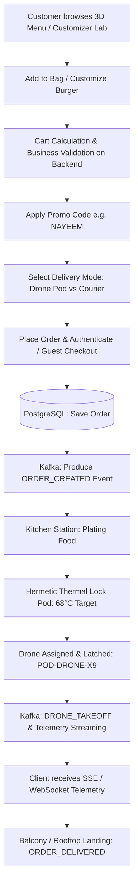
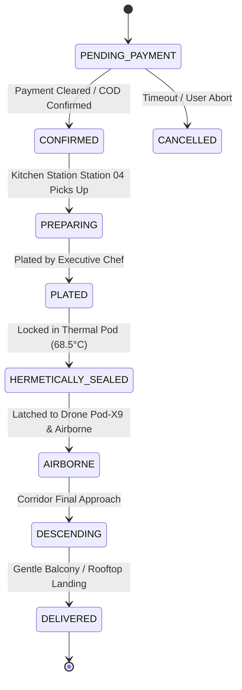
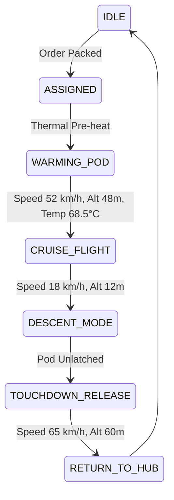

# Nayeem Spices // 3D Food Delivery Platform
## Backend Architecture, Domain Specification & API Contract

**Version:** 1.0.0  
**Target Stack:** Node.js (TypeScript), PostgreSQL, Redis, Apache Kafka, JWT Authentication, Docker, REST & Server-Sent Events / WebSockets  
**Context:** Production-grade backend architecture strictly mapped to the existing frontend application and extended with full business domain logic, server-side validation, and event-driven state machines.

---

## 1. Frontend Codebase Analysis & Domain Requirements

### 1.1 Identified Entities & Domain Models

| Entity | Description & Attributes | Frontend Source |
| :--- | :--- | :--- |
| **User** | `id`, `email`, `password_hash`, `full_name`, `phone`, `role` (`CUSTOMER`, `CHEF`, `DISPATCHER`, `ADMIN`), `addresses` (array/relation), `created_at`, `updated_at` | `FoodNavbar.tsx`, `CartDrawer.tsx` |
| **Address** | `id`, `user_id`, `street_address` (e.g., *Skyline Tower, Suite 44B*), `city`, `zip_code`, `balcony_pad_enabled` (boolean), `latitude`, `longitude`, `delivery_notes` | `FoodNavbar.tsx`, `LiveTrackingSection.tsx` |
| **Category** | `id` (`burgers`, `pizza`, `ramen`, `sushi`, `desserts`), `label`, `display_order`, `is_active` | `MenuSection.tsx`, `types/index.ts` |
| **FoodItem** | `id`, `name`, `tagline`, `category_id`, `price`, `rating`, `reviews_count`, `prep_time_minutes`, `calories`, `spicy_level` (0-3), `is_chef_special`, `is_popular`, `description`, `image_url`, `model_type` (`burger`, `pizza`, `ramen`, `sushi`), `is_available` | `data/foodData.ts`, `types/index.ts` |
| **Ingredient** | `id`, `name`, `food_item_id`, `is_allergen`, `display_order` | `foodData.ts`, `FoodModal3D.tsx` |
| **CustomizerOption** | Option type (`patty`, `cheese`, `topping`), `name`, `additional_price`, `calories`, `is_active` | `CustomizerSection.tsx`, `FoodModal3D.tsx` |
| **Cart** / **CartItem** | `cart_id`, `user_id` / `session_token`, `items`: array of (`food_id`, `quantity`, `selected_toppings`, `patty_count`, `cheese_type`, `calculated_unit_price`) | `App.tsx`, `CartDrawer.tsx` |
| **PromoCode** | `code` (e.g. `NAYEEM`, `TASTE`, `CRAVE3D`, `CHEF`), `discount_amount` ($5.00), `discount_type` (`FIXED` or `PERCENTAGE`), `min_order_subtotal`, `max_uses`, `current_uses`, `expires_at`, `is_active` | `CartDrawer.tsx` |
| **Order** | `id`, `order_number` (e.g. `ORD-2026-9041`), `user_id`, `delivery_type` (`drone` vs `courier`), `delivery_address_id`, `subtotal`, `delivery_fee`, `discount_amount`, `total_amount`, `promo_code_used`, `status` (state machine), `drone_id`, `created_at` | `CartDrawer.tsx`, `LiveTrackingSection.tsx` |
| **OrderItem** | `id`, `order_id`, `food_item_id`, `item_name`, `unit_price`, `quantity`, `total_price`, `patty_count`, `cheese_type`, `toppings` (JSON/relation), `special_instructions` | `CartDrawer.tsx`, `App.tsx` |
| **Drone** | `id` (e.g. `POD-DRONE-X9`), `drone_code`, `status` (`IDLE`, `ASSIGNED`, `IN_FLIGHT`, `MAINTENANCE`), `battery_percent`, `corridor_id`, `current_lat`, `current_lng`, `altitude_meters`, `speed_kmh`, `pod_temperature_celsius` | `LiveTrackingSection.tsx`, `DeliveryDrone3D.tsx` |
| **DroneTelemetryLog** | `id`, `drone_id`, `order_id`, `timestamp`, `pod_temperature`, `speed_kmh`, `altitude_meters`, `eta_minutes`, `distance_km`, `status` | `types/index.ts`, `LiveTrackingSection.tsx` |
| **Review** | `id`, `author_name`, `role_title`, `avatar_url`, `dish_name`, `food_item_id`, `quote`, `rating` (1-5), `is_critic_review`, `created_at` | `FoodReviews.tsx` |
| **NewsletterSubscriber** | `id`, `email`, `subscribed_at`, `is_active`, `tier` (`VIP_CHEF_LIST`) | `FoodFooter.tsx` |

---

### 1.2 User Roles & Access Control Matrix

| Role | Permissions & Operational Scope |
| :--- | :--- |
| **ANONYMOUS / GUEST** | View menu, inspect 3D models, calculate custom burger price/calories, validate promo codes, guest order checkout with ephemeral session. |
| **CUSTOMER** | Authenticated user profile, save delivery addresses (balcony landing pads), view order history, real-time drone telemetry streaming for active orders. |
| **KITCHEN CHEF** | View incoming orders, trigger kitchen milestones: `PREPARING` → `PLATED` → `HERMETICALLY_SEALED`. |
| **DRONE DISPATCHER** | Manage drone fleet, monitor live radar, simulate/override drone telemetry, assign drones to hermetic thermal pods, update delivery milestones. |
| **ADMIN** | Full CRUD over menu catalog, ingredients, promo codes, telemetry logs, customer reviews, and analytics. |

---

### 1.3 Business Workflows & Operations



---

### 1.4 Business-Critical Server-Side Validation Rules

> [!CAUTION]
> **Zero Frontend Trust**: Under no circumstance does the backend trust client-submitted calculations for `subtotal`, `deliveryFee`, `totalPrice`, `calories`, or `discount`.

1. **Patty Count Validation**:
   - Allowed values: strictly integer `1`, `2`, or `3`.
   - Extra patty charge: `$4.50` per extra patty (above 1). Extra calories: `+240 kcal` per patty.
2. **Cheese Selection Validation**:
   - Permitted options: `Melting Aged Gouda`, `Smoked Cheddar`, `Truffle Havarti`, `Pepper Jack`.
3. **Topping & Ingredient Pricing**:
   - Available customizer toppings and fixed prices:
     - `Crispy Smoked Pancetta`: `$2.80` (120 kcal)
     - `Pickled Habanero Jalapeños`: `$1.20` (15 kcal)
     - `Black Truffle Aioli`: `$1.50` (90 kcal)
     - `Caramelized Balsamic Shallots`: `$1.50` (45 kcal)
     - `Organic Fried Duck Egg`: `$2.20` (110 kcal)
   - Modal 3D extra toppings: fixed `$2.20` per selected item.
   - Backend dynamically computes the canonical item price and rejects tampered values with HTTP `422 Unprocessable Entity`.
4. **Delivery Fee Business Logic**:
   - If computed `subtotal > $40.00`, `delivery_fee = $0.00` (Free VIP Delivery).
   - If `subtotal <= $40.00`:
     - `delivery_type === 'drone'` => `$3.99`
     - `delivery_type === 'courier'` => `$2.50`
5. **Promo Code Rules**:
   - Valid codes: `NAYEEM`, `TASTE`, `CRAVE3D`, `CHEF`.
   - Code is normalized via `.trim().toUpperCase()`.
   - Fixed discount: `$5.00` off total.
   - Guard against negative balances: `finalTotal = Math.max(0, subtotal + deliveryFee - discount)`.
   - Usage limit: once per customer / order.
6. **Quantity Validation**:
   - Integer between `1` and `99`.
7. **Email & Contact Validation**:
   - Strictly conforms to RFC 5322 regex.
   - Newsletter prevents duplicate active registrations.

---

### 1.5 State Transition Machines

#### A. Order Lifecycle State Machine


#### B. Drone Telemetry & Pod Climate State Machine


---

## 2. Backend System Architecture

```
+-----------------------------------------------------------------------------------+
|                              Client Layer (React 19 + Three.js)                   |
|   - 3D Menu Catalog       - Burger Customizer Lab     - Slide-Out Cart Checkout  |
|   - Live Drone Radar      - 3D Food Modal Studio      - VIP Newsletter           |
+-----------------------------------------------------------------------------------+
                                         │
                   HTTPS / JSON (REST)   │   SSE / WebSocket (Live Drone Radar)
                                         ▼
+-----------------------------------------------------------------------------------+
|                        Node.js / Express API Gateway (Port 5000)                  |
|  - Rate Limiter (Redis token bucket)      - CORS & Helmet Security Headers       |
|  - JWT Authentication & RBAC Middleware    - Zod DTO Validation Middleware        |
|  - Centralized Exception & Audit Handler   - SSE Event Stream Manager             |
+-----------------------------------------------------------------------------------+
         │                                   │                           │
         ▼                                   ▼                           ▼
+-----------------------+           +------------------+        +-------------------+
|    PostgreSQL 16      |           |     Redis 7      |        |   Apache Kafka    |
| - Users & Addresses   |           | - Telemetry Cache|        | - orders.events   |
| - Menu & Categories   |           | - Rate Limiting  |        | - drone.telemetry |
| - Orders & Items      |           | - Session Store  |        | - notifications   |
| - Reviews & Promos    |           | - Pub/Sub Stream |        +-------------------+
+-----------------------+           +------------------+
```

### 2.1 Technology Decisions & Rationale

- **Runtime & Language**: Node.js v20+ with TypeScript for end-to-end type safety with the frontend interfaces.
- **Database (PostgreSQL)**: ACID compliance for financial orders, relational integrity between dishes, ingredients, custom options, and orders.
- **Cache & Pub/Sub (Redis)**: Sub-millisecond caching of menu catalog and drone coordinates, high-throughput pub/sub for real-time telemetry streaming to connected clients.
- **Event Streaming (Apache Kafka)**: Decoupled order event sourcing (`orders.events`), drone telemetry ingestion (`drone.telemetry`), reliable delivery guarantees and fault-tolerant messaging.
- **Authentication**: JWT (Access Token in `Authorization: Bearer <token>`, Refresh Token in HttpOnly cookie or secure exchange).
- **Graceful Fallbacks**: Production Docker orchestration with automated fallback to high-performance in-memory engines during local developer environment startup when external Docker daemons are offline.

---

## 3. Database Schema (PostgreSQL DDL)

```sql
-- 1. Users and Profiles
CREATE TABLE users (
    id UUID PRIMARY KEY DEFAULT gen_random_uuid(),
    email VARCHAR(255) UNIQUE NOT NULL,
    password_hash VARCHAR(255) NOT NULL,
    full_name VARCHAR(100) NOT NULL,
    phone VARCHAR(30),
    role VARCHAR(20) NOT NULL DEFAULT 'CUSTOMER' CHECK (role IN ('CUSTOMER', 'CHEF', 'DISPATCHER', 'ADMIN')),
    created_at TIMESTAMP WITH TIME ZONE DEFAULT CURRENT_TIMESTAMP,
    updated_at TIMESTAMP WITH TIME ZONE DEFAULT CURRENT_TIMESTAMP
);

-- 2. Delivery Addresses
CREATE TABLE addresses (
    id UUID PRIMARY KEY DEFAULT gen_random_uuid(),
    user_id UUID REFERENCES users(id) ON DELETE CASCADE,
    label VARCHAR(50) DEFAULT 'Home',
    street_address VARCHAR(255) NOT NULL,
    unit_suite VARCHAR(50) DEFAULT 'Suite 44B',
    city VARCHAR(100) NOT NULL DEFAULT 'Skyline Metropolis',
    latitude NUMERIC(10, 6) DEFAULT 37.774929,
    longitude NUMERIC(10, 6) DEFAULT -122.419416,
    balcony_pad_enabled BOOLEAN DEFAULT true,
    delivery_notes TEXT,
    created_at TIMESTAMP WITH TIME ZONE DEFAULT CURRENT_TIMESTAMP
);

-- 3. Categories
CREATE TABLE categories (
    id VARCHAR(50) PRIMARY KEY,
    label VARCHAR(100) NOT NULL,
    display_order INT NOT NULL DEFAULT 0,
    is_active BOOLEAN NOT NULL DEFAULT true
);

-- 4. Food Items Catalog
CREATE TABLE food_items (
    id VARCHAR(100) PRIMARY KEY,
    name VARCHAR(150) NOT NULL,
    tagline VARCHAR(255) NOT NULL,
    category_id VARCHAR(50) REFERENCES categories(id) ON DELETE RESTRICT,
    price NUMERIC(8, 2) NOT NULL,
    rating NUMERIC(3, 2) NOT NULL DEFAULT 5.00,
    reviews_count INT NOT NULL DEFAULT 0,
    prep_time VARCHAR(50) NOT NULL DEFAULT '12-15 min',
    calories INT NOT NULL,
    spicy_level INT NOT NULL DEFAULT 0 CHECK (spicy_level BETWEEN 0 AND 3),
    is_chef_special BOOLEAN NOT NULL DEFAULT false,
    is_popular BOOLEAN NOT NULL DEFAULT false,
    description TEXT NOT NULL,
    ingredients JSONB NOT NULL DEFAULT '[]'::jsonb,
    image VARCHAR(500) NOT NULL,
    model_type VARCHAR(50) NOT NULL CHECK (model_type IN ('burger', 'pizza', 'ramen', 'sushi')),
    is_available BOOLEAN NOT NULL DEFAULT true,
    created_at TIMESTAMP WITH TIME ZONE DEFAULT CURRENT_TIMESTAMP
);

-- 5. Customizer Options
CREATE TABLE customizer_options (
    id UUID PRIMARY KEY DEFAULT gen_random_uuid(),
    option_type VARCHAR(50) NOT NULL CHECK (option_type IN ('patty', 'cheese', 'topping', 'modal_extra')),
    name VARCHAR(100) NOT NULL,
    additional_price NUMERIC(6, 2) NOT NULL DEFAULT 0.00,
    calories INT NOT NULL DEFAULT 0,
    is_active BOOLEAN NOT NULL DEFAULT true
);

-- 6. Promo Codes
CREATE TABLE promo_codes (
    code VARCHAR(50) PRIMARY KEY,
    discount_amount NUMERIC(6, 2) NOT NULL DEFAULT 5.00,
    discount_type VARCHAR(20) NOT NULL DEFAULT 'FIXED' CHECK (discount_type IN ('FIXED', 'PERCENTAGE')),
    min_order_subtotal NUMERIC(6, 2) NOT NULL DEFAULT 0.00,
    max_uses INT DEFAULT 10000,
    current_uses INT DEFAULT 0,
    expires_at TIMESTAMP WITH TIME ZONE,
    is_active BOOLEAN NOT NULL DEFAULT true
);

-- 7. Drone Fleet
CREATE TABLE drones (
    id VARCHAR(50) PRIMARY KEY, -- e.g. POD-DRONE-X9
    drone_code VARCHAR(50) NOT NULL UNIQUE,
    status VARCHAR(50) NOT NULL DEFAULT 'IDLE' CHECK (status IN ('IDLE', 'ASSIGNED', 'IN_FLIGHT', 'RETURNING', 'MAINTENANCE')),
    battery_level INT NOT NULL DEFAULT 100,
    altitude_m NUMERIC(5, 1) DEFAULT 48.0,
    speed_kmh NUMERIC(5, 1) DEFAULT 52.0,
    pod_temperature_c NUMERIC(4, 1) DEFAULT 68.5,
    corridor_name VARCHAR(100) DEFAULT 'Direct Flight Corridor #12',
    updated_at TIMESTAMP WITH TIME ZONE DEFAULT CURRENT_TIMESTAMP
);

-- 8. Orders
CREATE TABLE orders (
    id UUID PRIMARY KEY DEFAULT gen_random_uuid(),
    order_number VARCHAR(50) UNIQUE NOT NULL,
    user_id UUID REFERENCES users(id) ON DELETE SET NULL,
    customer_name VARCHAR(100) NOT NULL,
    customer_email VARCHAR(255) NOT NULL,
    delivery_type VARCHAR(30) NOT NULL CHECK (delivery_type IN ('drone', 'courier')),
    delivery_address TEXT NOT NULL,
    subtotal NUMERIC(8, 2) NOT NULL,
    delivery_fee NUMERIC(6, 2) NOT NULL,
    discount_amount NUMERIC(6, 2) NOT NULL DEFAULT 0.00,
    total_amount NUMERIC(8, 2) NOT NULL,
    promo_code VARCHAR(50),
    status VARCHAR(50) NOT NULL DEFAULT 'CONFIRMED' CHECK (
        status IN ('PENDING_PAYMENT', 'CONFIRMED', 'KITCHEN_PREPARING', 'PLATED', 'HERMETICALLY_SEALED', 'AIRBORNE', 'DESCENDING', 'DELIVERED', 'CANCELLED')
    ),
    drone_id VARCHAR(50) REFERENCES drones(id) ON DELETE SET NULL,
    eta_minutes INT DEFAULT 14,
    created_at TIMESTAMP WITH TIME ZONE DEFAULT CURRENT_TIMESTAMP,
    updated_at TIMESTAMP WITH TIME ZONE DEFAULT CURRENT_TIMESTAMP
);

-- 9. Order Items
CREATE TABLE order_items (
    id UUID PRIMARY KEY DEFAULT gen_random_uuid(),
    order_id UUID REFERENCES orders(id) ON DELETE CASCADE,
    food_item_id VARCHAR(100) REFERENCES food_items(id) ON DELETE SET NULL,
    item_name VARCHAR(150) NOT NULL,
    unit_price NUMERIC(8, 2) NOT NULL,
    quantity INT NOT NULL CHECK (quantity > 0),
    patty_count INT DEFAULT 1,
    cheese_type VARCHAR(100),
    selected_toppings JSONB DEFAULT '[]'::jsonb,
    special_instructions TEXT,
    item_total NUMERIC(8, 2) NOT NULL
);

-- 10. Reviews & Ratings
CREATE TABLE reviews (
    id UUID PRIMARY KEY DEFAULT gen_random_uuid(),
    name VARCHAR(100) NOT NULL,
    role VARCHAR(100) NOT NULL,
    avatar VARCHAR(500) NOT NULL,
    dish VARCHAR(150) NOT NULL,
    quote TEXT NOT NULL,
    rating INT NOT NULL CHECK (rating BETWEEN 1 AND 5),
    is_critic BOOLEAN DEFAULT true,
    created_at TIMESTAMP WITH TIME ZONE DEFAULT CURRENT_TIMESTAMP
);

-- 11. Newsletter Subscribers
CREATE TABLE newsletter_subscribers (
    id UUID PRIMARY KEY DEFAULT gen_random_uuid(),
    email VARCHAR(255) UNIQUE NOT NULL,
    tier VARCHAR(50) DEFAULT 'VIP_CHEF_LIST',
    subscribed_at TIMESTAMP WITH TIME ZONE DEFAULT CURRENT_TIMESTAMP
);

-- Indexes for high-frequency queries
CREATE INDEX idx_food_items_category ON food_items(category_id);
CREATE INDEX idx_orders_user_id ON orders(user_id);
CREATE INDEX idx_orders_status ON orders(status);
CREATE INDEX idx_drones_status ON drones(status);
```

---

## 4. API Specification & Endpoints Contract

### Base URL: `/api/v1`

### 4.1 Authentication & Profile
- `POST /api/v1/auth/register` — Register a customer or staff user. Returns access token and user profile.
- `POST /api/v1/auth/login` — Login with email and password. Returns access token, user profile, and role.
- `GET /api/v1/auth/me` — Authenticated profile lookup using JWT Bearer token.
- `POST /api/v1/auth/addresses` — Add or select saved balcony drone landing addresses.

### 4.2 Menu & 3D Catalog
- `GET /api/v1/menu` — Retrieve curated food catalog with category filtering (`?category=burgers`) and search filtering (`?search=wagyu`). Cached in Redis.
- `GET /api/v1/menu/:id` — Detailed dish metadata with ingredients and 3D model properties.
- `GET /api/v1/menu/categories` — List active categories.

### 4.3 Customizer Lab
- `GET /api/v1/customizer/options` — Retrieve available patty tiers, artisan cheeses, and gourmet toppings with prices and calories.
- `POST /api/v1/customizer/calculate` — **Server-side validation endpoint**:
  ```json
  // Request
  {
    "baseFoodId": "cyber-wagyu-burger",
    "pattyCount": 2,
    "cheeseType": "Melting Aged Gouda",
    "selectedToppings": ["Black Truffle Aioli", "Caramelized Balsamic Shallots"]
  }
  // Response (200 OK)
  {
    "basePrice": 18.99,
    "extraPattyPrice": 4.50,
    "toppingsPrice": 3.00,
    "totalPrice": 26.49,
    "totalCalories": 1155,
    "isValid": true,
    "signature": "custom-burger-sig-token"
  }
  ```

### 4.4 Promo Codes
- `POST /api/v1/promos/validate` — Validate promo code:
  ```json
  // Request
  { "code": "NAYEEM", "subtotal": 35.49 }
  // Response (200 OK)
  {
    "valid": true,
    "code": "NAYEEM",
    "discountAmount": 5.00,
    "message": "$5.00 VIP discount applied!"
  }
  ```

### 4.5 Orders & Checkout
- `POST /api/v1/orders` — Create new order with full server validation:
  ```json
  // Request
  {
    "customerName": "Chef Connoisseur",
    "customerEmail": "guest@nayeespices.com",
    "deliveryType": "drone",
    "deliveryAddress": "Skyline Tower, Suite 44B (Balcony Pad Enabled)",
    "promoCode": "NAYEEM",
    "items": [
      {
        "foodId": "cyber-wagyu-burger",
        "quantity": 1,
        "pattyCount": 2,
        "cheeseType": "Melting Aged Gouda",
        "selectedToppings": ["Black Truffle Aioli", "Caramelized Balsamic Shallots"]
      }
    ]
  }
  // Response (201 Created)
  {
    "orderId": "3fa85f64-5717-4562-b3fc-2c963f66afa6",
    "orderNumber": "ORD-2026-9041",
    "status": "CONFIRMED",
    "subtotal": 26.49,
    "deliveryFee": 3.99,
    "discountAmount": 5.00,
    "totalAmount": 25.48,
    "etaMinutes": 14,
    "droneId": "POD-DRONE-X9",
    "message": "Order Dispatched to Drone Pod!"
  }
  ```
- `GET /api/v1/orders/:id` — Retrieve current order status, drone telemetry, and milestone timeline.
- `PATCH /api/v1/orders/:id/status` — Role-protected endpoint for kitchen chefs and drone dispatchers to progress the order state machine.

### 4.6 Realtime Drone Fleet Telemetry (SSE & WebSocket)
- `GET /api/v1/telemetry/live` — Server-Sent Events (SSE) stream broadcasting real-time drone telemetry:
  ```
  event: telemetry
  data: {
    "droneId": "POD-DRONE-X9",
    "altitudeMeters": 48.2,
    "speedKmH": 52.4,
    "podTemperature": 68.5,
    "corridor": "Direct Flight Corridor #12",
    "etaMinutes": 13,
    "status": "in_flight",
    "milestones": [
      {"label": "Plated by Executive Chef", "completed": true, "timestamp": "10:48 AM"},
      {"label": "Hermetically Sealed in Thermal Pod", "completed": true, "timestamp": "10:51 AM"},
      {"label": "Airborne En Route to Destination", "completed": true, "timestamp": "10:53 AM"},
      {"label": "Gentle Landing at Rooftop / Balcony", "completed": false, "timestamp": "Estimated 11:06 AM"}
    ]
  }
  ```

### 4.7 Reviews & Newsletter
- `GET /api/v1/reviews` — Retrieve customer and critic reviews.
- `POST /api/v1/reviews` — Submit a food review.
- `POST /api/v1/newsletter/subscribe` — Register email for the VIP Chef List.

---

## 5. Docker Orchestration Plan

The multi-container Docker composition consists of:
1. `postgres`: PostgreSQL 16 Alpine container with database `nayeem_spices_db`.
2. `redis`: Redis 7 Alpine cache and pub/sub broker.
3. `zookeeper` & `kafka`: Apache Kafka message broker configured for order events & drone radar telemetry.
4. `api`: Node.js Express server running on port 5000 with volume hot-reloading for development and production build stages.

---

## 6. Implementation Milestones

1. **Backend Infrastructure**: Initialize TypeScript project with Express, Zod, JWT, bcrypt, PostgreSQL pool, Redis client, and KafkaJS.
2. **Database Seeds**: Seed standard artisan dishes, customizer options, promo codes, and initial reviews from the frontend data model.
3. **Domain Services & Routes**: Implement auth, catalog, customizer calculations, order lifecycle state machine, and live telemetry streaming.
4. **Frontend API Integration**: Connect React frontend to live endpoints with seamless fallback so the application is 100% functional both with and without active Docker containers.
5. **Flow Testing**: End-to-end verification of menu loading, 3D customizer pricing calculation, promo code application, bag checkout, and drone radar simulation.
